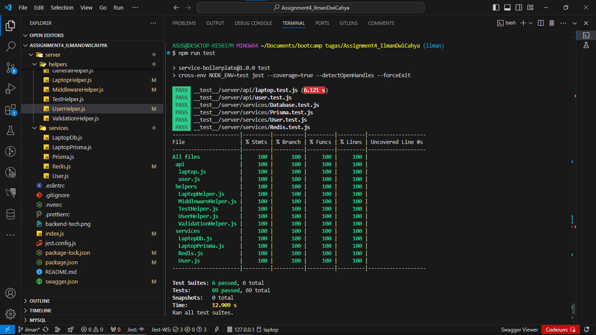
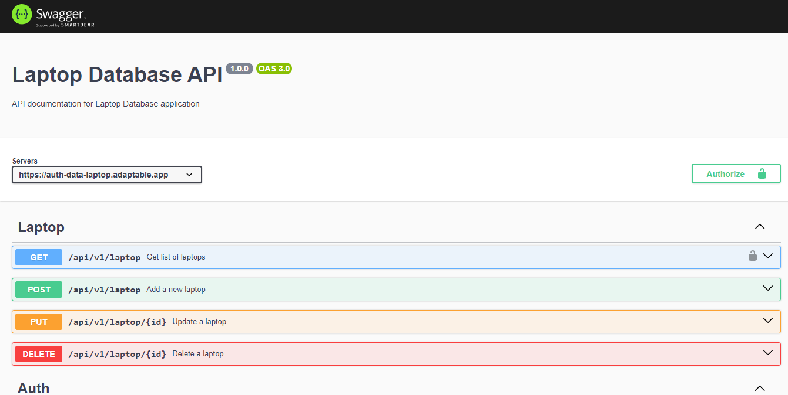

# CRUD API Data Laptop

My task is to create a RESTful API, according to the given requirements.
Your users should be able to:

Notes:

- Start with this boilerplate https://github.com/nabhannaufal/service-boilerplate, remove unused code
- Add logger in code (error, debug or info)
- Add Unit test, should be pass `coverageThreshold`
- Use MYSQL Database
- Create 2 version api
    - V1 using parameterized sql queries
- Add validation request
- Add handle response status (200, 400, 500)
- Create documentation on file README.md
- Deploy your project
- Submission
    - Repository [Github](https://github.com/) or [Gitlab](https://gitlab.com/)
    - Postman Collection

### Requirement

1. Create RESTful API to Create application for inventory management
2. The application should allow users to add, read, update and delete product information, such as name, price and stock

## Stack

Summary of what the stack looks like now including a picture with the core tech:

> - **express**: A fast and minimalist web framework for Node.js, providing a powerful set of features for building web applications and APIs.
> - **dotenv**: This library makes it easier to manage application configuration by using `.env` files to define environment variables, thus separating configuration from source code.
> - **boom**: This library is used to create HTTP-friendly errors in Node.js. Very useful for handling errors in web applications.
> - **joi**: A schema validation library that helps in defining and validating JavaScript object structures, especially useful for user input validation.
> - **mysql2**: A MySQL driver for Node.js that supports Promises and provides an API compatible with `mysql`. It is faster and more efficient than `mysql`.
> - **prisma**: A modern ORM (Object-Relational Mapping) for Node.js and TypeScript that simplifies interaction with databases through a powerful, type-safe query builder.
> - **lodash**: A JavaScript utility library that provides many useful functions for manipulating arrays, objects, and other data types.
> - **JSONStream**: Library for working with JSON streams. Useful for processing large JSON data without having to load everything into memory.
> - **pino**: A very fast and JSON-friendly logger for Node.js. Designed for high performance and large log volumes.
> - **Jest**: Wrote unit and integration tests for backend services using Jest. Ensured code quality and functionality through comprehensive test coverage.
> - **Supertest**: Employed Supertest for HTTP assertions in API testing. Validated endpoints, checked response codes, and ensured the correctness of API behaviors.

	

## Deployment

For this assigment, deployment web api crud : [https://crud-data-laptop.adaptable.app/](https://crud-data-laptop.adaptable.app/)

## API

### Request Laptop

`GET`  `https://crud-data-laptop.adaptable.app/api/v1/laptop`

`POST` `https://crud-data-laptop.adaptable.app/api/v1/laptop`

`PUT`  `https://crud-data-laptop.adaptable.app/api/v1/laptop/:id`

`DELETE`  `https://crud-data-laptop.adaptable.app/api/v1/laptop/:id`

### Request User

`POST` `https://crud-data-laptop.adaptable.app/api/v1/user/register`

`POST` `https://crud-data-laptop.adaptable.app/api/v1/user/login`

## Unit Testing Result

  

## Documentation API

This is documetaion api using Swagger and you can access it to test the api [here](https://auth-data-laptop.adaptable.app/api/docs/)

  

